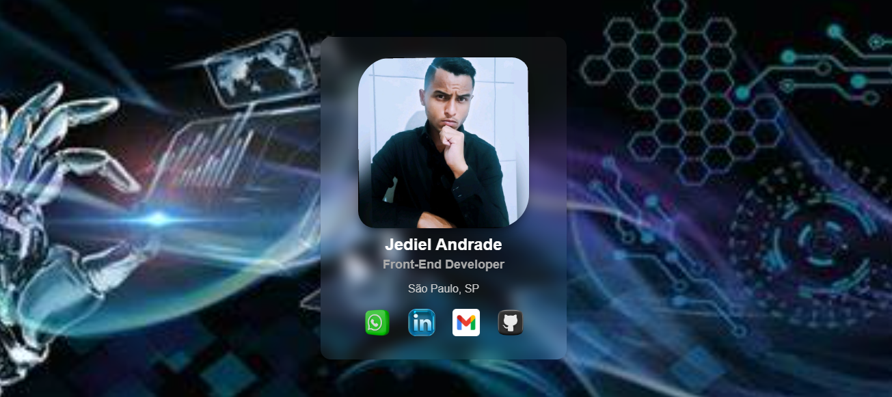

<h1 align="center">💻 Portfólio Card</h1>

  

  Um cartão de apresentação com visual moderno, responsivo e links interativos. Desenvolvido com HTML e CSS puro para destacar habilidades e facilitar conexões profissionais.

---

## 🚀 Tecnologias
- HTML5  
- CSS3  
- Responsividade  
- Animações com Hover

---

## 🎯 Funcionalidades
- Visual clean e profissional  
- Links interativos para:
  - WhatsApp  
  - LinkedIn  
  - Gmail  
  - GitHub

---

## 📸 Preview

---

## 🔗 Acesse o projeto online

👉 [(https://jediel-dev.netlify.app/)](https://jediel-dev.netlify.app/ 

---

## 📬 Contato

Entre em contato comigo:  
📧 [andradejediel70@gmail.com](mailto:andradejediel70@gmail.com)  
📱 [WhatsApp](https://wa.me/5511961651633)

---

